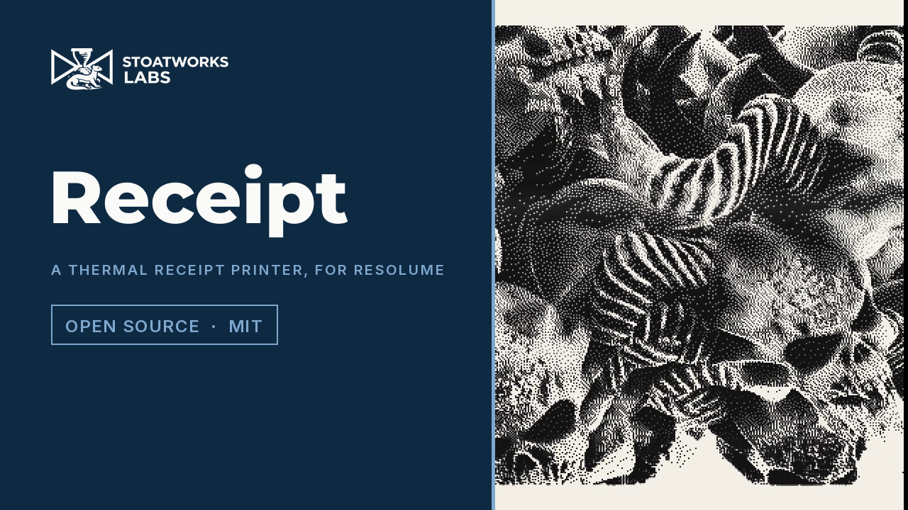

# receipt

> **AI-assisted project.** This codebase was created with [Claude](https://claude.com/claude-code)
> (Anthropic), directed and reviewed by a human author. The printer is not
> asserted but measured: an offline harness drives the real plugin class in a
> headless GL context and reads each claim back out of the picture it made —
> the fraction of dots each dither fires on flat greys is the tone, within that
> dither's derived bound; a vertical line thickens by exactly the dots the heat
> model predicts, from the predicted row, and runs on below its end for the
> predicted rows, and does not thicken under history control; a strobe block
> over the supply's budget prints at the predicted lower density, and every step
> in density sits on a block boundary; a forced slip repeats or overprints
> exactly the stated rows; every dot lands on its whole-pixel cell; Printing
> scrolls by elapsed time, the same rows at 60, 50 and 30 frames a second; and a
> resize mid-print keeps every printed dot — with a negative control per check
> that proves each can fail, at two rasters and on the software renderer. It has
> **never been loaded into Resolume on macOS**. It has been loaded by
> [oxbow](https://github.com/stoatworks-labs/oxbow), which is a real FFGL host and
> is not Resolume. See [Status](#status).

A thermal receipt printer, as an FFGL effect for
[Resolume](https://resolume.com) Arena and Avenue.


<sub>One frame, rendered by `rctest`, the offline harness — not captured from
Resolume. The defaults, on the harness's test card, over a dark background so the
paper's edges show (off the paper is transparent). Nothing here is drawn as a
smear or a band: the rule across the whole head is pale because a row that fires
that many dots sags the supply, and every mark trails a tail because its heaters
are still warm on the rows after it.</sub>

[](https://www.youtube.com/watch?v=LjLpCcH3WSE)

*[Watch it](https://www.youtube.com/watch?v=LjLpCcH3WSE) — 73 seconds:
the skulls at the defaults, a receipt printing out of the slot in real time on the dancers
(Printing, Tile) and tearing off, the three dithers on the skulls, heat carried until the rings
thicken and trail tails and then History Control thinning them, dark footage at one, two, four
and eight strobe blocks, slips breaking the rings into steps, an aged receipt on canary and pink
paper, and a 58 mm roll with Mix down to the clip. Every frame is the real plugin's output: an
FFGL plugin has no window, so the footage is rendered by this repository's own offline harness
(`rctest --pipe`, driven by a cue sheet) rather than filmed off a screen, and the clips are
Resolume's bundled demo media.*

<!-- downloads:start -->

## Download

**[v0.1.0](https://github.com/stoatworks-labs/receipt/releases/tag/v0.1.0)** — prebuilt for macOS and Windows. Pick your platform:

<details>
<summary><b>macOS</b> — Universal (Apple Silicon + Intel)</summary>

| Build | Download | Size |
| --- | --- | --- |
| Universal (Apple Silicon + Intel) · .dmg disk image | [`receipt-0.1.0-macos-universal.dmg`](https://github.com/stoatworks-labs/receipt/releases/download/v0.1.0/receipt-0.1.0-macos-universal.dmg) | 212 KB |
| Universal (Apple Silicon + Intel) · .zip archive | [`receipt-macos-universal.zip`](https://github.com/stoatworks-labs/receipt/releases/latest/download/receipt-macos-universal.zip) | 176 KB |

</details>

<details>
<summary><b>Windows</b> — x64</summary>

| Build | Download | Size |
| --- | --- | --- |
| x64 · .exe installer | [`receipt-0.1.0-windows-x86_64-setup.exe`](https://github.com/stoatworks-labs/receipt/releases/download/v0.1.0/receipt-0.1.0-windows-x86_64-setup.exe) | 221 KB |
| x64 · .zip archive | [`receipt-windows-x86_64.zip`](https://github.com/stoatworks-labs/receipt/releases/latest/download/receipt-windows-x86_64.zip) | 113 KB |

</details>

All builds, checksums and release notes: [github.com/stoatworks-labs/receipt/releases](https://github.com/stoatworks-labs/receipt/releases).

macOS builds are signed and notarised and open normally. The Windows builds are unsigned, so SmartScreen warns once.

<!-- downloads:end -->

## The one idea

A thermal printer has a fixed line of tiny heaters — 8 to the millimetre, 576
across an 80 mm roll — and no ink. The paper darkens where it gets hot enough.
The head prints one dot row at a time as the stepper pulls the paper, so **the
physics of heat is the whole look**. What falls out, none of it drawn:

- **Tone is a dither.** A dot is on or off, so a grey is a pattern: an 8×8 Bayer
  matrix, Floyd–Steinberg or Atkinson, in raster order, as the firmware does it.
- **Heat history.** A heater that fired on the last row is still warm, so the next
  row's dot there darkens more and the heat reaches the paper beside it: vertical
  lines thicken, every mark runs on below itself, and dark areas block up. The
  firmware's `History Control` shortens a warm heater's strobe to compensate; it
  cannot cool a heater that is not firing.
- **The head's energy budget.** The supply can only fire so many dots at once, so
  the head is strobed in blocks and a block with many black dots sags. Dense rows
  print paler, and a row whose blocks differ in coverage bands at the block
  boundaries — on dark footage, a banded grey with a seam down the head.
- **The feed.** A slipping roller repeats a row, or stalls while the data moves on
  and overprints a dark band.
- **Age.** An old receipt is pale and yellowed, the dye gone brown, darkest at the
  tear edge where it was held.

`Static` prints the frame as a receipt. `Printing` scrolls the receipt out of the
slot at `Print Speed`, each new row printed from the frame showing when the head
reached it, and tears it off at `Tear Length`.

## Controls

| Group | | |
| --- | --- | --- |
| **Printer** | Width | 58 mm (384 dots) or 80 mm (576) |
| | Dither | Bayer, Floyd-Steinberg, Atkinson |
| | Density | the strobe energy: half the paper's saturation to one and a half times it |
| | Heat Carry | how much of a heater's heat is left at the next row |
| | History Control | how much of that the firmware takes off a firing heater |
| | Strobe Blocks | 1 to 8 blocks across the head; fewer blocks, more sag |
| **Feed** | Print Speed | 2 to 250 mm/s (Printing) |
| | Slip | how often the roller slips: up to one row in fifty |
| | Mode | Static or Printing |
| | Tear Length | 30 to 600 mm |
| **Paper** | Age | fade, yellowing, and the held edge |
| | Paper Tint | White, Ivory, Canary, Pink, Blue, Green |
| | Fit | Letterbox, Rotate (the clip's width down the paper), Tile |
| | Mix | |

The dots are square and a whole number of output pixels across (3 px at 1080p
on 80 mm); the paper is opaque and off it is transparent, so the layer below
shows round the receipt. A transparent clip prints blank paper.

## Status

**v0.1.0, released 2026-09-25.** Built from the fleet's templates in one session.
The [user guide](https://stoatworks-labs.com/software/receipt/guide/) covers every
control. What `tools/verify.sh` establishes on this Mac (Apple M4 Max, macOS
26.4), on a fresh universal build, at **320×180 and 1280×720**, and again at
320×180 on Apple's software renderer:

| check | what it establishes |
| --- | --- |
| `--dither` | on ten flat greys Bayer fires exactly count/64 of its dots, Floyd–Steinberg is within 0.0013 of the tone (bound 0.0053) at 320×180 and 0.0009 (0.0029) at 1280×720, Atkinson within 0.068 (bound 0.13) — and Atkinson prints nothing at all below an eighth, exactly |
| `--history` | at Heat Carry 0.81 a 9-dot line is 11 dots wide from its fifth row, as the heat model predicts, and runs on 11 rows below its end; under full history control it stays 9 dots and runs on 3; every density within 10⁻⁷ of the closed form |
| `--budget` | at 2, 3 and 4 strobe blocks every dot of four bands of chosen coverage prints at the stated sag to 10⁻⁷ (the palest dot of a solid row at D = 0.02, 0.35 and 0.80), and every density step sits within a dot of a block boundary |
| `--slip` | forced repeats and stalls of 1 and 3 rows move exactly the stated rows and no others |
| `--grid` | every pixel is ink, paper or off the paper exactly as the dot grid says (921,600 of them at 1280×720, pitch 2), every cell uniform |
| `--printing` | the rows printed after 0.45 s are the same at 60, 50 and 30 fps, and a frame's rows sit exactly where elapsed time puts them; the receipt tears at the length |
| `--resize` | 77,760 dots (29,122 of them ink) unchanged across a resize mid-print |
| `--alpha` | paper alpha 1 and off-paper 0 from a half-transparent clip; Mix fades both; a clear clip prints blank |
| `--negative` | seven perturbed printers — no heat carried, no budget, diffusion that loses its error, a short slip, a fractional pitch, a per-frame clock, a resize that clears the paper — each **fails** its check |
| mutation | one character of the shipped GLSL (the tear notch's depth) was caught by `--alpha` at both rasters, then reverted |
| `tools/sweep.py` | all **14** controls measurably change the picture |
| shaders | all 3, as the plugin compiles them, through `glslc`; no reserved word |
| `--pipe` | 2.5 frames in, exactly 2 out; an unknown cue refused (2); a failed render and a closed stdout (`\| head -c 1`) each exit 1; options and integers step, sliders ramp |
| the bundle | universal (`x86_64 arm64`, the two slices' output byte-identical under Rosetta), exports `plugMain`, ad-hoc signs; `oxbow` reports `SW Receipt` / `RC01` / `effect` and renders 120 frames |

Render cost at the defaults, best of three runs of 60 frames, `glFinish` both
sides, on a machine shared with other builds: **1.7 ms** at 720p, **1.9 ms** at
1080p, **2.6 ms** at 4K (Bayer 0.9 / 1.1 / 1.4 ms; Printing 0.4 / 0.4 / 1.1 ms).
The print itself — dither, heat, budget, paper — runs on the CPU at the head's
resolution, 1.2 ms whatever the output's size; Floyd–Steinberg is serial in both
directions and a GPU form would be over a thousand dependent draws a frame
([AGENTS.md](AGENTS.md) has the numbers). macOS figures only.

Seen on footage: eight of Resolume's bundled demo clips through `--pipe`, judged
by eye. Bright-on-black clips print as a banded dark-grey receipt with the lit
shapes left in paper white; the clips with alpha print their shapes as marks on
white paper. Not measured.

### Not established

It has **never been loaded into Resolume on macOS**. Everything above was compiled,
rendered and measured offline against the real plugin class in a headless CGL
context, plus an `oxbow` load. The read-back that feeds the CPU waits for the GPU;
what that costs inside a real composition is unmeasured. The printer's constants
(the paper's threshold and saturation, the heat's spread, the supply's budget)
are chosen, not measured from a printer. Feed jitter is not modelled (slips are
whole rows), and a dense row sags rather than being re-strobed. On Windows, a build of
this source loads, registers and renders in Resolume Arena 7.27.1 on software
rendering (win-lab, no GPU), with every control as declared and all 14 moving the
picture (the fleet's Arena gate, 9 of 9) — which says nothing about a GPU or about
speed. No OpenFX port, no browser demo, no presets.

## Build

Needs CMake 3.15+, a C++17 compiler, and the FFGL SDK submodule.

```bash
git clone --recursive https://github.com/stoatworks-labs/receipt
cd receipt
cmake -B build -DCMAKE_BUILD_TYPE=Release
cmake --build build --parallel
cmake --install build     # into ~/Documents/Resolume Arena/Extra Effects
```

macOS builds are universal (Apple Silicon + Intel) by default; add
`-DCMAKE_OSX_ARCHITECTURES=arm64` for a faster dev build. Windows needs GLEW via vcpkg.

## Building and testing

The offline harness renders the real plugin class headlessly:

```bash
./build/rctest --out /tmp/frame.png --size 1920x1080   # the moving card
./build/rctest --list                                  # every control, kind and default
./build/rctest --dither --history --budget --slip --grid --printing --resize --alpha
./build/rctest --negative                              # and the checks can fail
./build/rctest --offline                               # what needs no GL (CI)
./build/rctest --bench                                 # 720p, 1080p and 4K, by stage
python3 tools/sweep.py                                 # no control is silently dead
tools/verify.sh                                        # all of it, on a fresh universal build
```

Every check takes `--size`; run it at 320×180 as well as the raster you care
about, and with `RCTEST_RENDERER=software` for what CI sees. Footage goes through
the real plugin with `--pipe`, in the fleet's frame format; `--fps` is the clock
Printing scrolls by:

```bash
ffmpeg -i in.mov -f rawvideo -pix_fmt rgba - \
  | ./build/rctest --pipe --size 1920x1080 --fps 30 --script cues.txt \
  | ffmpeg -f rawvideo -pix_fmt rgba -s 1920x1080 -r 30 -i - out.mov
```

See [`CLAUDE.md`](CLAUDE.md) for the full command reference and
[`AGENTS.md`](AGENTS.md) for the model and the traps.

<!-- attributions:start -->
This project is built on other people's work — see [ATTRIBUTIONS.md](ATTRIBUTIONS.md).
<!-- attributions:end -->

## Licence

MIT — see [LICENSE](LICENSE).
